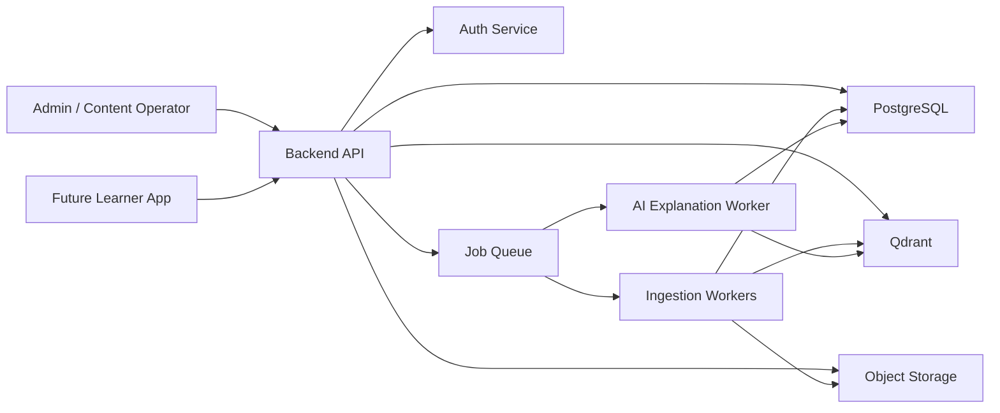
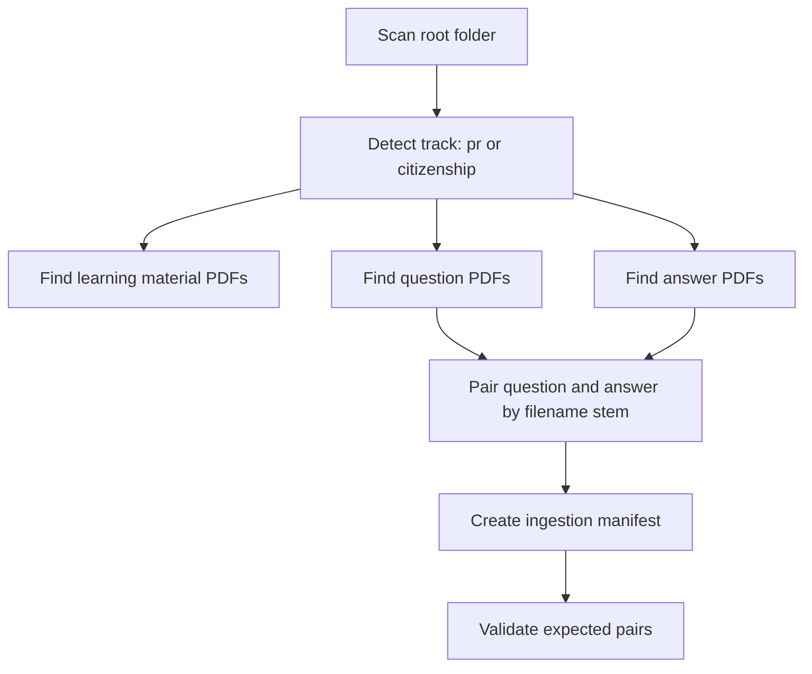
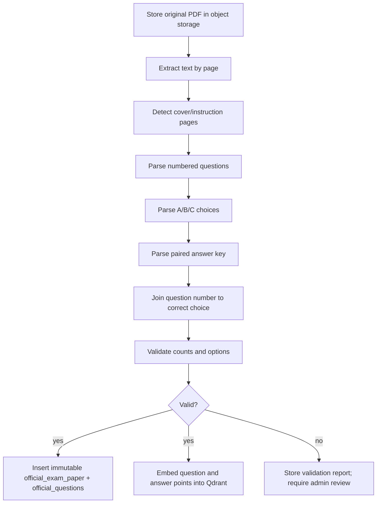
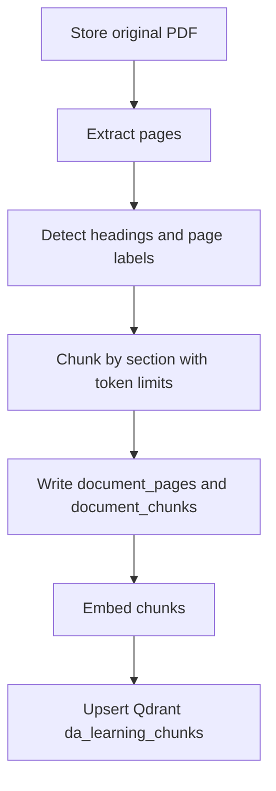
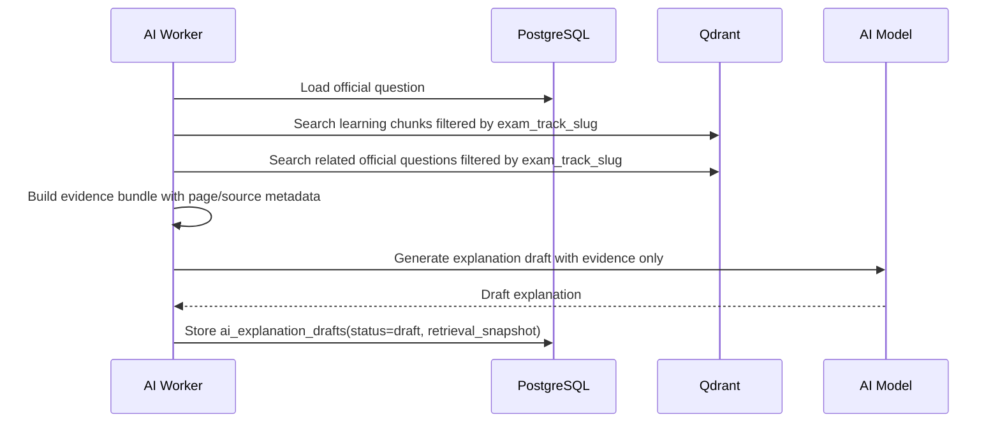
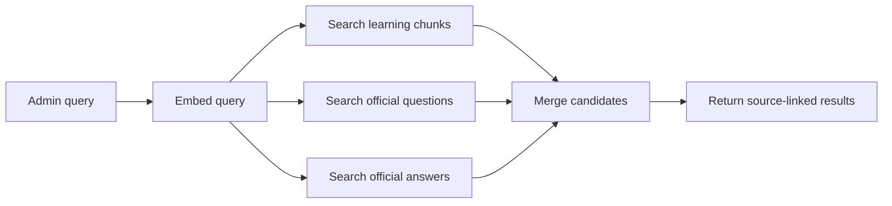
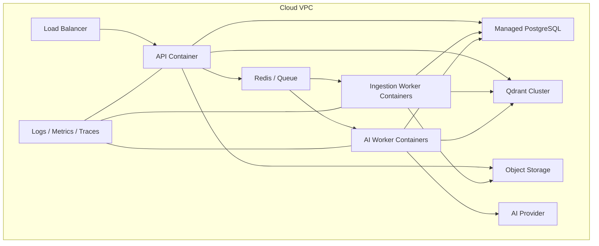

# Denmark Academy - Phase 1 Architecture

Version: 0.1  
Scope: architecture, schemas, ingestion, storage, retrieval, metadata, infrastructure  
Out of scope: frontend features, quizzes, AI chat UX, payment, certificates

## 1. Source Material Observed

Workspace layout:

```text
danish/
  pr/
    question/1.pdf ... 16.pdf
    answers/1.pdf ... 16.pdf
    learning material/pr learning material.pdf
  citizenship/
    questions/1.pdf ... 13.pdf
    answers/1.pdf ... 13.pdf
    learning material/citizenship test learning material.pdf
```

Important observations:

- There are two independent exam tracks:
  - `pr`: Permanent Residence / Medborgerskabsproeven.
  - `citizenship`: Danish Citizenship / Indfoedsretsproeven.
- Question PDFs and answer PDFs are paired by filename. Example: `pr/question/1.pdf` pairs with `pr/answers/1.pdf`.
- Official question PDFs are extractable text PDFs. The body follows numbered questions with `A:`, `B:`, and sometimes `C:` answer choices.
- Official answer PDFs are compact answer keys: question number plus correct option letter.
- Learning-material PDFs are large official books and should be chunked by page, section, and semantic boundaries.
- Both official questions/answers and learning material must be stored in Qdrant for semantic retrieval.
- Official questions and official answer keys must also be stored in PostgreSQL as immutable canonical records.

## 2. Architectural Goal

Phase 1 creates the durable backend foundation for Denmark Academy:

- One shared platform and one authentication system.
- PostgreSQL owns structured, relational, auditable data.
- Qdrant owns semantic retrieval over official material, official questions, official answers, and approved/draft explanation context.
- Object storage owns original PDFs and extraction artifacts.
- Ingestion pipelines convert folders of official PDFs into validated database records and vector payloads.
- An Exam Blueprint Engine models exam rules as data instead of hardcoded logic.
- AI explanations are generated as drafts only and require admin approval before use.

## 3. System Context



Design reason:

- The backend API should not parse PDFs inline. PDF parsing, embedding, answer-key matching, and validation are long-running tasks and belong in workers.
- PostgreSQL and Qdrant are kept separate because structured exam integrity and semantic search have different correctness models.
- Object storage keeps every original PDF and extraction artifact reproducible, which is critical for official material.

## 4. Proposed Monorepo Structure

```text
denmark-academy/
  apps/
    api/                         # REST API, auth integration, admin endpoints
    worker-ingestion/            # PDF extraction, parsing, validation, embedding writes
    worker-ai/                   # AI explanation draft generation
  packages/
    db/                          # SQL migrations, Prisma/Drizzle models, seed scripts
    contracts/                   # OpenAPI specs, shared DTO schemas
    exam-blueprint/              # Blueprint validation and exam assembly rules
    retrieval/                   # Qdrant clients, filters, reranking interfaces
    document-parser/             # PDF extraction and question/answer parsers
    observability/               # logs, tracing, metrics helpers
  infra/
    docker/
      Dockerfile.api
      Dockerfile.worker
    compose/
      docker-compose.local.yml
    terraform/
      modules/
        postgres/
        qdrant/
        object-storage/
        app-service/
        queue/
  docs/
    PHASE_1_ARCHITECTURE.md
    api.openapi.yml
    ingestion-runbook.md
```

Design reason:

- `apps/` contains deployable services.
- `packages/` contains domain logic reusable across API and workers.
- `infra/` is cloud-ready without forcing one provider during Phase 1.
- `contracts/` prevents frontend and worker code from inventing incompatible payload shapes later.

## 5. Service Boundaries

| Service | Responsibility | Does Not Do |
| --- | --- | --- |
| API | Authenticated admin/content APIs, blueprint APIs, retrieval APIs | PDF parsing, embedding batch jobs |
| Ingestion Worker | Reads PDFs, extracts text, parses questions/answers, chunks books, writes PostgreSQL/Qdrant | User-facing request handling |
| AI Worker | Generates explanation drafts, stores them pending approval | Publishes explanations without admin approval |
| PostgreSQL | Canonical structured data, immutable official records, approvals, audit logs | Semantic nearest-neighbor search |
| Qdrant | Vector search over official material/questions/answers | Canonical correctness source |
| Object Storage | Original PDFs, extracted text, parser reports | Query-time structured joins |

## 6. PostgreSQL Schema

Recommended extensions:

```sql
CREATE EXTENSION IF NOT EXISTS pgcrypto;
CREATE EXTENSION IF NOT EXISTS citext;
```

### 6.1 Identity And Access

```sql
CREATE TABLE users (
  id uuid PRIMARY KEY DEFAULT gen_random_uuid(),
  email citext NOT NULL UNIQUE,
  password_hash text,
  external_auth_provider text,
  external_auth_subject text,
  role text NOT NULL CHECK (role IN ('student', 'admin', 'reviewer')),
  created_at timestamptz NOT NULL DEFAULT now(),
  updated_at timestamptz NOT NULL DEFAULT now()
);

CREATE TABLE audit_events (
  id uuid PRIMARY KEY DEFAULT gen_random_uuid(),
  actor_user_id uuid REFERENCES users(id),
  action text NOT NULL,
  entity_type text NOT NULL,
  entity_id uuid,
  metadata jsonb NOT NULL DEFAULT '{}',
  created_at timestamptz NOT NULL DEFAULT now()
);
```

Design reason:

- One identity model supports both tracks.
- Roles are intentionally simple for Phase 1 but can evolve into RBAC tables.
- Every content mutation should emit an audit event.

### 6.2 Exam Tracks

```sql
CREATE TABLE exam_tracks (
  id uuid PRIMARY KEY DEFAULT gen_random_uuid(),
  slug text NOT NULL UNIQUE CHECK (slug IN ('pr', 'citizenship')),
  name text NOT NULL,
  official_name text NOT NULL,
  locale text NOT NULL DEFAULT 'da-DK',
  is_active boolean NOT NULL DEFAULT true,
  created_at timestamptz NOT NULL DEFAULT now()
);
```

Seed:

```text
pr           Permanent Residence       Medborgerskabsproeven
citizenship  Danish Citizenship        Indfoedsretsproeven
```

### 6.3 Source Documents

```sql
CREATE TABLE source_documents (
  id uuid PRIMARY KEY DEFAULT gen_random_uuid(),
  exam_track_id uuid NOT NULL REFERENCES exam_tracks(id),
  source_type text NOT NULL CHECK (source_type IN ('learning_material', 'question_paper', 'answer_key')),
  original_filename text NOT NULL,
  source_path text NOT NULL,
  storage_uri text NOT NULL,
  content_sha256 text NOT NULL,
  file_size_bytes bigint NOT NULL,
  page_count int,
  publication_date date,
  exam_date date,
  exam_session_label text,
  language text NOT NULL DEFAULT 'da',
  ingestion_status text NOT NULL DEFAULT 'pending'
    CHECK (ingestion_status IN ('pending', 'extracting', 'validated', 'failed')),
  parser_version text NOT NULL,
  metadata jsonb NOT NULL DEFAULT '{}',
  created_at timestamptz NOT NULL DEFAULT now(),
  UNIQUE (exam_track_id, source_type, content_sha256)
);

CREATE INDEX idx_source_documents_track_type ON source_documents(exam_track_id, source_type);
```

Design reason:

- `content_sha256` prevents accidental duplicate ingestion.
- `source_path` preserves the local folder convention.
- `storage_uri` allows cloud object storage later.

### 6.4 Extracted Pages And Chunks

```sql
CREATE TABLE document_pages (
  id uuid PRIMARY KEY DEFAULT gen_random_uuid(),
  source_document_id uuid NOT NULL REFERENCES source_documents(id) ON DELETE CASCADE,
  page_number int NOT NULL,
  extracted_text text NOT NULL,
  extraction_method text NOT NULL CHECK (extraction_method IN ('text', 'ocr', 'hybrid')),
  extraction_confidence numeric(5,4),
  metadata jsonb NOT NULL DEFAULT '{}',
  created_at timestamptz NOT NULL DEFAULT now(),
  UNIQUE (source_document_id, page_number)
);

CREATE TABLE document_chunks (
  id uuid PRIMARY KEY DEFAULT gen_random_uuid(),
  source_document_id uuid NOT NULL REFERENCES source_documents(id) ON DELETE CASCADE,
  page_start int NOT NULL,
  page_end int NOT NULL,
  section_title text,
  chunk_index int NOT NULL,
  text text NOT NULL,
  token_count int,
  qdrant_point_id uuid,
  metadata jsonb NOT NULL DEFAULT '{}',
  created_at timestamptz NOT NULL DEFAULT now(),
  UNIQUE (source_document_id, chunk_index)
);
```

Design reason:

- Pages are retained for traceability.
- Chunks are optimized for retrieval and can point to Qdrant point IDs.

### 6.5 Official Exam Papers And Questions

```sql
CREATE TABLE official_exam_papers (
  id uuid PRIMARY KEY DEFAULT gen_random_uuid(),
  exam_track_id uuid NOT NULL REFERENCES exam_tracks(id),
  question_document_id uuid NOT NULL REFERENCES source_documents(id),
  answer_document_id uuid REFERENCES source_documents(id),
  paper_code text NOT NULL,
  exam_date date,
  title text NOT NULL,
  duration_minutes int,
  expected_question_count int,
  parser_version text NOT NULL,
  validation_status text NOT NULL DEFAULT 'pending'
    CHECK (validation_status IN ('pending', 'valid', 'invalid', 'needs_review')),
  validation_report jsonb NOT NULL DEFAULT '{}',
  created_at timestamptz NOT NULL DEFAULT now(),
  UNIQUE (exam_track_id, paper_code)
);

CREATE TABLE official_questions (
  id uuid PRIMARY KEY DEFAULT gen_random_uuid(),
  exam_track_id uuid NOT NULL REFERENCES exam_tracks(id),
  official_exam_paper_id uuid NOT NULL REFERENCES official_exam_papers(id),
  question_number int NOT NULL,
  stem text NOT NULL,
  choice_a text NOT NULL,
  choice_b text NOT NULL,
  choice_c text,
  correct_choice text NOT NULL CHECK (correct_choice IN ('A', 'B', 'C')),
  source_page_start int,
  source_page_end int,
  qdrant_point_id uuid,
  content_sha256 text NOT NULL,
  immutable_version int NOT NULL DEFAULT 1,
  metadata jsonb NOT NULL DEFAULT '{}',
  created_at timestamptz NOT NULL DEFAULT now(),
  UNIQUE (official_exam_paper_id, question_number),
  UNIQUE (content_sha256)
);

CREATE OR REPLACE FUNCTION prevent_official_question_update()
RETURNS trigger AS $$
BEGIN
  RAISE EXCEPTION 'official_questions are immutable; create a superseding record instead';
END;
$$ LANGUAGE plpgsql;

CREATE TRIGGER trg_official_questions_immutable
BEFORE UPDATE OR DELETE ON official_questions
FOR EACH ROW EXECUTE FUNCTION prevent_official_question_update();
```

Design reason:

- Official questions and answer keys are canonical records and must not drift after ingestion.
- Corrections should be represented by superseding records or errata tables, not updates.

### 6.6 Question Errata

```sql
CREATE TABLE official_question_errata (
  id uuid PRIMARY KEY DEFAULT gen_random_uuid(),
  official_question_id uuid NOT NULL REFERENCES official_questions(id),
  errata_type text NOT NULL CHECK (errata_type IN ('typo', 'answer_key_correction', 'source_reference', 'other')),
  proposed_by_user_id uuid REFERENCES users(id),
  status text NOT NULL DEFAULT 'draft' CHECK (status IN ('draft', 'approved', 'rejected')),
  note text NOT NULL,
  replacement_payload jsonb,
  created_at timestamptz NOT NULL DEFAULT now(),
  reviewed_at timestamptz,
  reviewed_by_user_id uuid REFERENCES users(id)
);
```

### 6.7 AI Explanation Drafts

```sql
CREATE TABLE ai_explanation_drafts (
  id uuid PRIMARY KEY DEFAULT gen_random_uuid(),
  official_question_id uuid NOT NULL REFERENCES official_questions(id),
  generated_text text NOT NULL,
  model_provider text NOT NULL,
  model_name text NOT NULL,
  prompt_version text NOT NULL,
  retrieval_snapshot jsonb NOT NULL,
  status text NOT NULL DEFAULT 'draft'
    CHECK (status IN ('draft', 'approved', 'rejected', 'superseded')),
  reviewer_user_id uuid REFERENCES users(id),
  review_note text,
  approved_text text,
  created_at timestamptz NOT NULL DEFAULT now(),
  reviewed_at timestamptz
);

CREATE TABLE approved_explanations (
  id uuid PRIMARY KEY DEFAULT gen_random_uuid(),
  official_question_id uuid NOT NULL REFERENCES official_questions(id),
  ai_explanation_draft_id uuid NOT NULL REFERENCES ai_explanation_drafts(id),
  explanation_text text NOT NULL,
  qdrant_point_id uuid,
  created_at timestamptz NOT NULL DEFAULT now(),
  UNIQUE (official_question_id)
);
```

Design reason:

- AI output is never official by default.
- The retrieval snapshot records what evidence was used, supporting review and reproducibility.

### 6.8 Exam Blueprint Engine

```sql
CREATE TABLE exam_blueprints (
  id uuid PRIMARY KEY DEFAULT gen_random_uuid(),
  exam_track_id uuid NOT NULL REFERENCES exam_tracks(id),
  name text NOT NULL,
  version int NOT NULL,
  status text NOT NULL DEFAULT 'draft' CHECK (status IN ('draft', 'active', 'retired')),
  total_questions int NOT NULL,
  duration_minutes int NOT NULL,
  passing_score int,
  rules jsonb NOT NULL,
  effective_from date,
  effective_to date,
  created_by_user_id uuid REFERENCES users(id),
  created_at timestamptz NOT NULL DEFAULT now(),
  UNIQUE (exam_track_id, version)
);

CREATE TABLE exam_blueprint_sections (
  id uuid PRIMARY KEY DEFAULT gen_random_uuid(),
  exam_blueprint_id uuid NOT NULL REFERENCES exam_blueprints(id) ON DELETE CASCADE,
  section_key text NOT NULL,
  name text NOT NULL,
  question_count int NOT NULL,
  source_filter jsonb NOT NULL DEFAULT '{}',
  selection_strategy text NOT NULL CHECK (selection_strategy IN ('fixed', 'random', 'weighted_random')),
  sort_order int NOT NULL,
  UNIQUE (exam_blueprint_id, section_key)
);
```

Example blueprint JSON:

```json
{
  "question_source": "official_questions",
  "allow_reused_questions": false,
  "choice_shuffle": false,
  "requires_exact_official_answer": true,
  "sections": [
    {
      "section_key": "core_official",
      "question_count": 25,
      "filters": {
        "exam_track": "pr",
        "source_type": "past_paper"
      }
    }
  ],
  "validation": {
    "must_equal_total_questions": true,
    "must_have_answer_key": true
  }
}
```

Design reason:

- Exam rules change over time. A data-driven blueprint avoids deploying new code whenever duration, question count, current-topic split, or source mix changes.
- Blueprint versions preserve historical behavior.

## 7. Qdrant Vector Design

Use separate collections by semantic document class. This gives clear filter logic and allows different chunking/vector strategies later.

Recommended embedding size depends on provider/model. Store it as config, not hardcoded.

```text
collection: da_learning_chunks
vectors:
  text: dense vector
payload:
  object_type: "learning_chunk"
  exam_track_slug: "pr" | "citizenship"
  source_document_id: uuid
  source_document_sha256: string
  source_type: "learning_material"
  title: string
  section_title: string | null
  page_start: integer
  page_end: integer
  chunk_index: integer
  language: "da"
  publication_date: date | null
  text: string
  token_count: integer
  parser_version: string
  created_at: timestamp
```

```text
collection: da_official_questions
vectors:
  text: dense vector over stem + choices + correct answer text
payload:
  object_type: "official_question"
  exam_track_slug: "pr" | "citizenship"
  official_question_id: uuid
  official_exam_paper_id: uuid
  paper_code: string
  question_number: integer
  stem: string
  choices: object
  correct_choice: "A" | "B" | "C"
  correct_answer_text: string
  source_page_start: integer | null
  source_page_end: integer | null
  immutable_version: integer
  content_sha256: string
  language: "da"
  created_at: timestamp
```

```text
collection: da_official_answers
vectors:
  text: dense vector over normalized answer statement
payload:
  object_type: "official_answer"
  exam_track_slug: "pr" | "citizenship"
  official_question_id: uuid
  official_exam_paper_id: uuid
  question_number: integer
  correct_choice: "A" | "B" | "C"
  correct_answer_text: string
  answer_document_id: uuid
  language: "da"
  created_at: timestamp
```

```text
collection: da_explanations
vectors:
  text: dense vector over approved explanation text
payload:
  object_type: "approved_explanation"
  exam_track_slug: "pr" | "citizenship"
  official_question_id: uuid
  approved_explanation_id: uuid
  ai_explanation_draft_id: uuid
  status: "approved"
  language: "da"
  created_at: timestamp
```

Design reason:

- Storing official questions and answers in Qdrant enables semantic retrieval like "find past questions about the constitution" while PostgreSQL remains the source of truth.
- Separate collections make immutability and indexing policies simpler.
- Payloads duplicate essential metadata so retrieval can filter without joining PostgreSQL for every candidate.

## 8. Metadata Model

Every ingested item should carry:

```json
{
  "exam_track_slug": "pr",
  "source_type": "question_paper",
  "source_path": "pr/question/1.pdf",
  "paired_answer_path": "pr/answers/1.pdf",
  "source_document_id": "uuid",
  "content_sha256": "hex",
  "parser_version": "pdf-parser-v1",
  "language": "da",
  "publication_date": null,
  "exam_date": "2018-06-06",
  "page_start": 3,
  "page_end": 3,
  "extraction_method": "text",
  "extraction_confidence": 0.99,
  "validation": {
    "question_count_expected": 25,
    "question_count_parsed": 25,
    "answer_count_parsed": 25,
    "has_cover_page": true
  }
}
```

Design reason:

- Metadata must answer: where did this come from, how was it parsed, can we trust it, and how do we reproduce it?

## 9. Ingestion Workflow

### 9.1 Folder Discovery



Pairing rules:

- PR question folder is singular: `pr/question`.
- Citizenship question folder is plural: `citizenship/questions`.
- Answer folder is `answers` in both tracks.
- Pair by filename stem, for example `1.pdf` to `1.pdf`.
- Missing pair means ingestion manifest status `needs_review`.

### 9.2 Question Paper Pipeline



Validation checks:

- Every question number is sequential.
- Every question has `A` and `B`.
- `C` may be null because some questions have two options.
- Correct choice exists among available choices.
- Parsed answer count equals parsed question count.
- Expected count is inferred from document instructions and track history, then stored in validation report.

### 9.3 Learning Material Pipeline



Chunking strategy:

- Prefer section-aware chunks.
- Target 500-900 tokens per chunk.
- Use 80-120 token overlap across boundaries.
- Preserve page numbers and section titles.
- Do not merge PR and citizenship chunks unless explicitly cross-track retrieval is requested.

Design reason:

- Section-aware chunks produce better citations than arbitrary fixed windows.
- Page metadata supports admin review and future learner citations.

## 10. Retrieval Workflow

### 10.1 Explanation Draft Retrieval



Retrieval filter example:

```json
{
  "must": [
    { "key": "exam_track_slug", "match": { "value": "citizenship" } },
    { "key": "language", "match": { "value": "da" } }
  ]
}
```

Design reason:

- Explanation generation must be track-scoped to avoid mixing PR and citizenship rules.
- Drafts require approval because official answers are immutable and AI text is advisory.

### 10.2 Admin Search Retrieval



## 11. API Contracts

Base path: `/api/v1`

### Auth

```http
POST /auth/login
POST /auth/logout
GET  /auth/me
```

`GET /auth/me` response:

```json
{
  "id": "uuid",
  "email": "admin@example.com",
  "role": "admin"
}
```

### Tracks

```http
GET /exam-tracks
GET /exam-tracks/{trackSlug}
```

### Source Documents

```http
POST /admin/ingestion/manifests
GET  /admin/ingestion/runs/{runId}
GET  /admin/source-documents?track=pr&type=question_paper
GET  /admin/source-documents/{documentId}
```

Create manifest request:

```json
{
  "root_path": "C:/Users/Tech Mehal/Desktop/danish",
  "tracks": ["pr", "citizenship"],
  "parser_version": "pdf-parser-v1",
  "dry_run": true
}
```

### Official Questions

```http
GET /admin/official-papers?track=pr
GET /admin/official-papers/{paperId}
GET /admin/official-questions?track=pr&paperCode=1
GET /admin/official-questions/{questionId}
```

Question response:

```json
{
  "id": "uuid",
  "track": "pr",
  "paper_code": "1",
  "question_number": 1,
  "stem": "Hvor tit er der valg til kommunalbestyrelser og regionsraad?",
  "choices": {
    "A": "Hvert tredje aar",
    "B": "Hvert fjerde aar",
    "C": "Hvert femte aar"
  },
  "correct_choice": "B",
  "immutable_version": 1,
  "source": {
    "document_id": "uuid",
    "page_start": 3,
    "page_end": 3
  }
}
```

### Exam Blueprints

```http
POST /admin/exam-blueprints
GET  /admin/exam-blueprints?track=citizenship
GET  /admin/exam-blueprints/{blueprintId}
POST /admin/exam-blueprints/{blueprintId}/activate
POST /admin/exam-blueprints/{blueprintId}/validate
```

### AI Explanation Drafts

```http
POST /admin/official-questions/{questionId}/explanation-drafts
GET  /admin/explanation-drafts?status=draft&track=pr
GET  /admin/explanation-drafts/{draftId}
POST /admin/explanation-drafts/{draftId}/approve
POST /admin/explanation-drafts/{draftId}/reject
```

Approval request:

```json
{
  "approved_text": "Reviewed explanation text...",
  "review_note": "Approved after checking source pages."
}
```

### Retrieval

```http
POST /admin/retrieval/search
```

Request:

```json
{
  "track": "citizenship",
  "query": "grundloven og domstole",
  "collections": ["learning_chunks", "official_questions", "official_answers"],
  "limit": 10
}
```

## 12. Deployment Architecture



Local Docker Compose services:

```text
api
worker-ingestion
worker-ai
postgres
qdrant
redis
minio
```

Production recommendations:

- Managed PostgreSQL with daily backups and point-in-time recovery.
- Qdrant Cloud or self-hosted Qdrant with snapshots enabled.
- S3-compatible object storage for original PDFs and extraction artifacts.
- Redis or managed queue for ingestion/explanation jobs.
- Container registry and immutable image tags.
- OpenTelemetry traces from API and workers.
- Secrets in cloud secret manager, not environment files.

## 13. Dockerization Design

Container principles:

- API and workers use separate images or separate entrypoints from one base image.
- Containers are stateless.
- PDF parser dependencies are pinned.
- Migrations run as a release job, not automatically inside every API boot.
- Health checks:
  - API: `/healthz`, `/readyz`
  - Worker: queue connectivity and dependency checks
  - PostgreSQL/Qdrant/Redis: native health probes

## 14. Security And Governance

Required Phase 1 controls:

- Admin-only ingestion endpoints.
- Official question immutability enforced at database level.
- Audit logging for ingestion, approval, rejection, blueprint activation, and errata.
- Row-level future readiness by `exam_track_id`.
- Object storage bucket policy preventing public access to source PDFs.
- AI prompt/output retention tied to draft records.
- No AI draft can be exposed as approved content unless `status='approved'`.

## 15. Observability

Metrics:

- `ingestion_run_duration_seconds`
- `pdf_pages_extracted_total`
- `questions_parsed_total`
- `answer_keys_parsed_total`
- `ingestion_validation_failures_total`
- `qdrant_upsert_failures_total`
- `ai_drafts_created_total`
- `ai_drafts_approved_total`

Logs:

- Structured JSON logs with `run_id`, `track`, `source_document_id`, `paper_code`, `parser_version`.

Traces:

- API request span.
- Queue job span.
- PDF extraction span.
- PostgreSQL write span.
- Qdrant upsert span.

## 16. Phase 1 Build Order

1. Create database migrations for tracks, source documents, pages, chunks, official papers/questions, blueprints, drafts, approvals, and audit events.
2. Build source manifest scanner for the observed folder layout.
3. Build PDF text extraction with page retention.
4. Build answer-key parser.
5. Build question parser and pair with answer keys.
6. Add validation reports and fail-safe review status.
7. Add object storage adapter.
8. Add Qdrant schema provisioning and upsert logic.
9. Add admin API contracts for ingestion, questions, blueprints, retrieval, and draft approvals.
10. Add local Docker Compose with PostgreSQL, Qdrant, Redis, MinIO, API, and workers.

## 17. Key Design Decisions

| Decision | Choice | Reason |
| --- | --- | --- |
| Platform model | One shared backend with `exam_track_id` everywhere | Avoid duplicate auth and duplicated infrastructure while preserving independent exam tracks |
| Structured source of truth | PostgreSQL | Transactions, constraints, auditability, immutable official records |
| Semantic search | Qdrant | Purpose-built vector retrieval with metadata filters |
| Original files | Object storage | Reproducible ingestion and cloud portability |
| Official questions | Immutable PostgreSQL rows plus Qdrant points | Prevents silent correction drift while enabling search |
| AI explanations | Draft -> admin approval -> approved explanation | Keeps AI advisory until reviewed |
| Exam rules | Versioned blueprint engine | Prevents hardcoded rules and supports future exam changes |
| Ingestion | Worker-based pipeline | PDFs and embeddings are long-running and need retries |
| Metadata | Duplicated in PostgreSQL and Qdrant payloads | Fast retrieval filters plus canonical relational audit trail |
| Deployment | Dockerized stateless services | Cloud-ready and easy local parity |

## 18. Non-Goals For Phase 1

- No learner-facing frontend.
- No quiz-taking UX.
- No AI chat.
- No payment/subscription features.
- No manual editing of official immutable questions.
- No production-specific cloud provider lock-in.

## 19. Acceptance Criteria

Phase 1 is complete when:

- Both `pr` and `citizenship` tracks exist in PostgreSQL.
- The current folder layout can be scanned into an ingestion manifest.
- Every original PDF can be stored with hash, size, page count, and source metadata.
- Learning-material pages and chunks are stored in PostgreSQL and Qdrant.
- Question PDFs are parsed into official immutable questions.
- Answer PDFs are parsed and joined to the correct questions.
- Official questions and official answers are stored in Qdrant.
- Validation reports catch missing pairs, count mismatch, missing options, and invalid answer keys.
- Exam blueprints can be created, validated, versioned, and activated without code changes.
- AI explanation drafts can be generated and stored, but only approved drafts become approved explanations.
- Local Docker Compose can start PostgreSQL, Qdrant, Redis, MinIO, API, and workers.
